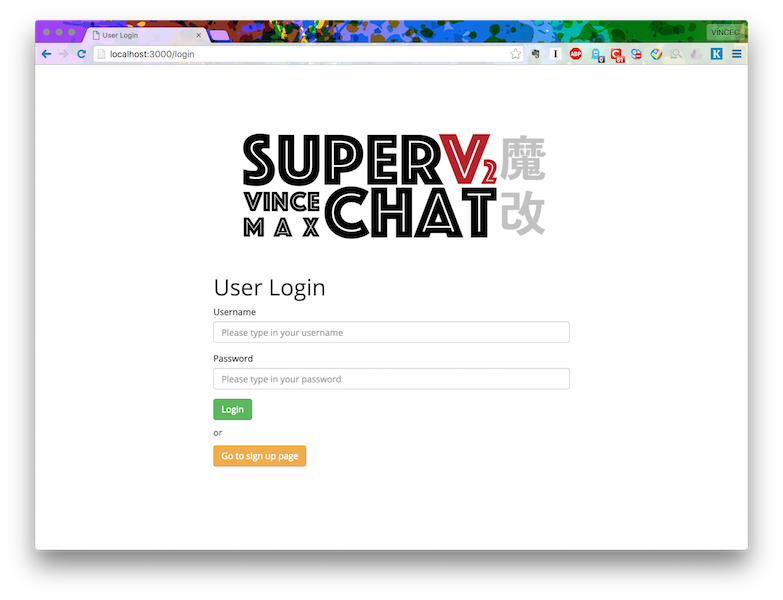
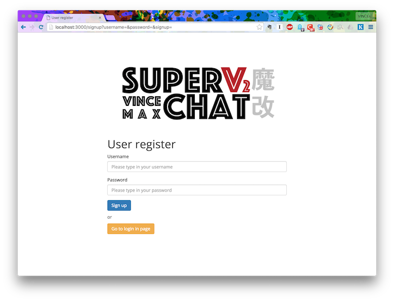
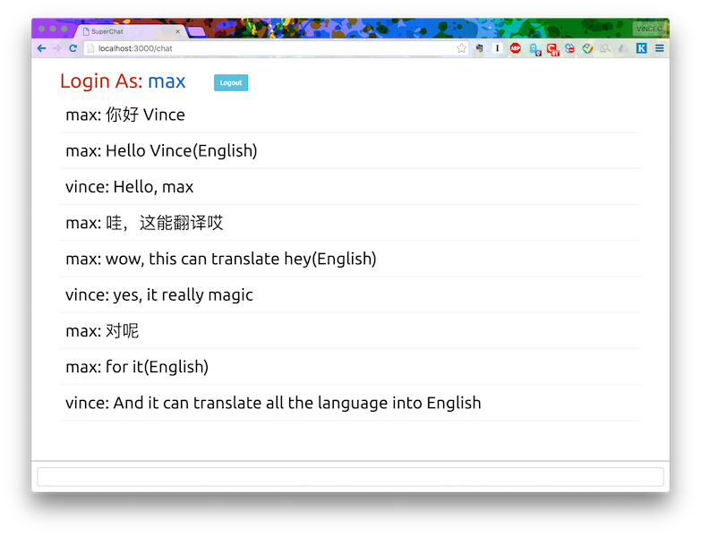

# Super Chat v2.魔改

This is one simple chatting web application for every registered users using it.

##[Video demo] (http://www.youtube.com/embed/bY-rzZFeEc8 "Video demo")##

###update logs:###

5/10/2016 
- realse Super Chat v2.魔改
- fix session and hit problems

3/14/2016 
- realse Super Chat version 1.0

3/13/2016 
- realse Super Chat version 0.0.1

###Screenshots###

## It realizes several features:

- Register(sign up) and login user interface.

- All password is in encryption.

- Not same username allowed when signing up.

- Only the username and password matches each other will enter the home page.

- Once user logins, a session well be created and server will remember the user and once logout it need to login again.

- Only after users logining, they can using chatting pages.

- Each user can check all registered username in mongodb in home page.

- In chatting page, all languages typed in not in English will be translated into English automatically.

- The completely sginup information will send in console for debug and check.

more feature need to you to find it..

## Request need to install in local

- Nodejs

- Mongdb

*Made by: Vince Cao & [Max Lee](https://github.com/maekks "Max Lee").*
See the details in [GitHub](http://github.com/vincecao/SuperChat "GitHub")
